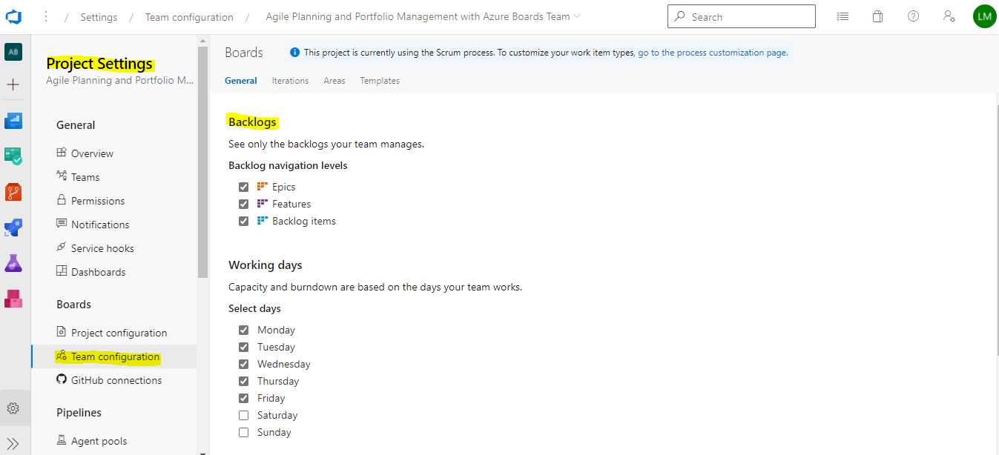
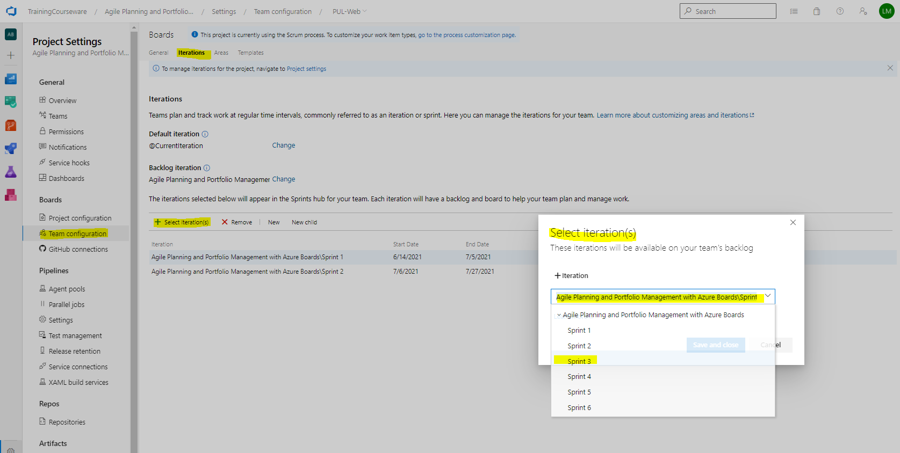
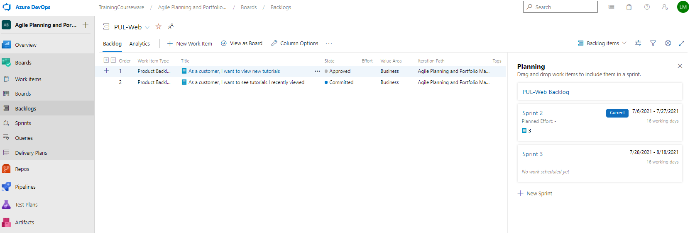

## Alumno: Lizbeth Gómes Monserratte

## Modulo 1 Lab 01: Agile Planning and Portfolio Management with Azure Boards

### Exercise 1: Manage Agile project

In this exercise, you will use Azure Boards to perform a number of common agile planning and portfolio management tasks, including management of teams, areas, iterations, work items, sprints and capacity, customizing Kanban boards, defining dashboards, and customizing team processes.

#### Task 1: Manage teams, areas, and iterations

### 

#### Task 2: Manage work items

#### Task 3: Manage sprints and capacity

# [Volver >>>](https://github.com/liztraining2021/CFTICIFCD3820611/blob/master/ContenidoEvidenciasAZ-204.md)

